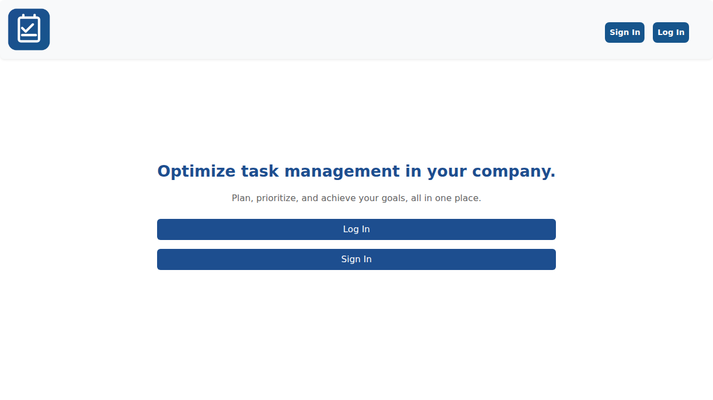
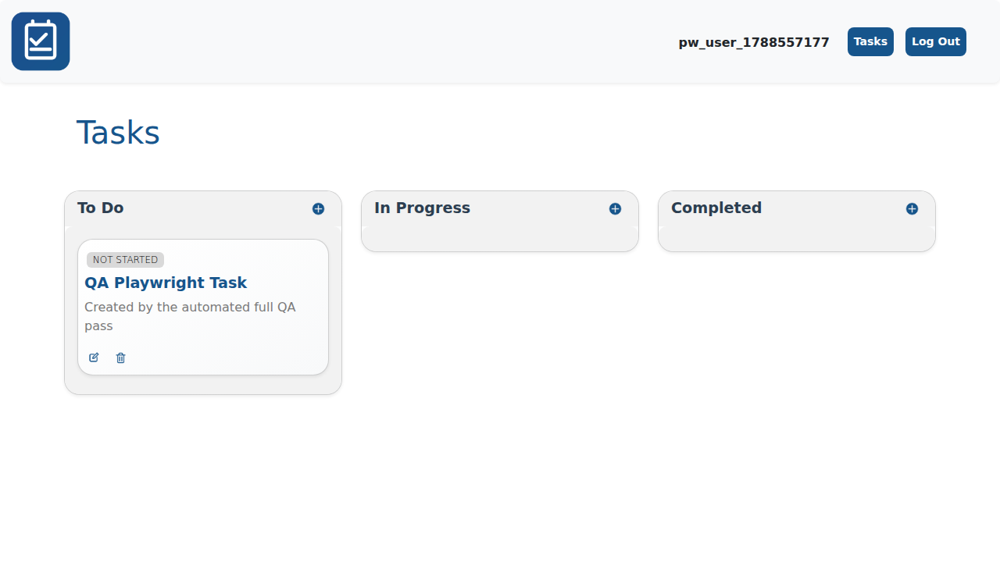
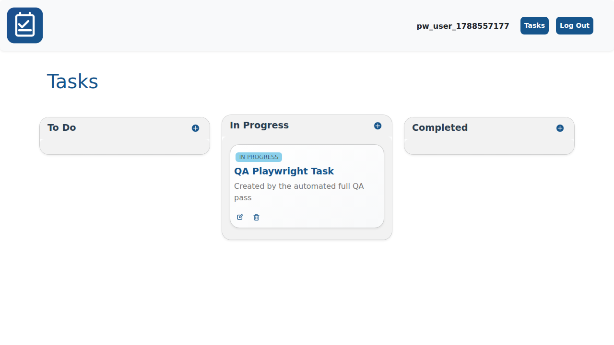
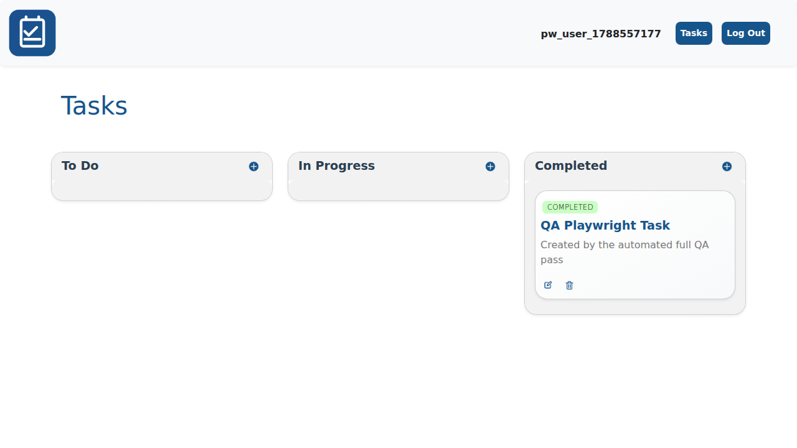

# TaskFlow

A multi-user task management web app built with **Flask**, **Flask-SQLAlchemy** and **SQLite**. Users register, log in, and organize their own tasks across three states (Not Started / In Progress / Completed) on a Trello-style board.

> **Background:** this project started as a university project (a simple to-do list app built with a "client" role-play exercise, tracked with sprints and a backlog). It has been reworked for this portfolio: hardcoded secrets were externalized, a task-listing query that scanned every user's tasks was fixed to filter at the database level, a real **IDOR (Insecure Direct Object Reference) vulnerability** letting any logged-in user edit or delete another user's tasks by guessing their numeric ID was found and fixed, error handling now logs the real exception instead of only showing "try again", and an unused dependency was removed. See **Project History** below for the specifics of what changed, and **QA** for how this was verified.

## Features

- User accounts: register, log in, log out. Passwords are hashed with Werkzeug's `generate_password_hash`/`check_password_hash` (never stored or transmitted in plain text).
- Each user only ever sees and manages their own tasks — enforced at the database query level, not just in the template.
- Tasks (title + description) move between three states — Not Started, In Progress, Completed — shown as a three-column board, with create/edit/delete via modals.
- Responsive layout (Bootstrap 5) that adapts the navigation to mobile.

## Architecture

A small, standard Flask application factory layout:

```
todor/
  __init__.py     Application factory (create_app): config, db init, blueprint registration.
  auth.py         Blueprint: register, login, logout, the login_required decorator and the
                  before_request hook that loads the current user onto g.user.
  todo.py         Blueprint: task list, create, update, delete - all scoped to g.user.
  models.py       SQLAlchemy models: User, Todo.
  templates/      Jinja2 templates (Bootstrap 5, a few small inline scripts for the modals).
  static/         CSS and icons.
run.py            Entry point: create_app().run()
```

## Tech stack

| Layer | Technology |
|---|---|
| Backend | Python, Flask, Flask-SQLAlchemy |
| Database | SQLite (file-based, via SQLAlchemy) |
| Auth | Server-side sessions, Werkzeug password hashing |
| Frontend | Jinja2 templates, Bootstrap 5, vanilla JS |

## Getting started

```bash
python -m venv .venv
source .venv/bin/activate        # Windows: .venv\Scripts\activate
pip install -r requirements.txt
python run.py
```

The app runs at `http://127.0.0.1:5000`. On first run it creates `instance/todolist.db` automatically (SQLite, via `db.create_all()`) — no separate migration step needed for this project's scope.

### Configuration

`SECRET_KEY`, `FLASK_DEBUG` and `DATABASE_URL` are read from environment variables, with safe development defaults if unset:

```bash
export SECRET_KEY="a-long-random-value"   # required for any real deployment
export FLASK_DEBUG=0                       # 1 only for local development
export DATABASE_URL="sqlite:///todolist.db"  # or any SQLAlchemy-compatible URL
```

Never commit a real `SECRET_KEY` — the app falls back to an obviously-fake development value (`dev-only-not-for-production`) when the variable isn't set, which is fine for running it locally but must be overridden anywhere it's actually exposed.

## Security notes

- Passwords are hashed (Werkzeug's PBKDF2-based hasher), never stored or logged in plain text.
- **Fixed during this rework — an IDOR vulnerability**: `GET /todo/update/<id>` and `POST /todo/delete/<id>` originally fetched a task by ID with no ownership check, so any logged-in user could view, edit or delete *any other user's* task just by changing the number in the URL. Both routes now verify `todo.created_by == g.user.id` and return `404` otherwise (see `get_todo()` in `todor/todo.py`). This was verified with an automated two-user test (see QA below), not just read by eye.
- The task list query now filters by the logged-in user at the SQL level (`Todo.query.filter_by(created_by=g.user.id)`) instead of fetching every user's tasks and filtering in the template — the old version worked (no data was rendered to the wrong user) but didn't scale and made the IDOR bug above easier to miss during review.
- No CSRF protection (Flask doesn't include it by default; would need Flask-WTF) — listed under Roadmap, out of scope for this pass.
- Username/password login only; no rate limiting on login attempts.
- **Fixed during a second QA pass — a client/server validation mismatch**: the server accepts usernames made of letters, numbers and underscores (`^[a-zA-Z0-9_]+$` in `auth.py`), but the registration page's client-side JS only allowed letters and numbers (`^[a-zA-Z0-9]+$`) and silently blocked the form (`event.preventDefault()`) on anything stricter than that, with a misleading "special characters" error. A username the server would happily accept could never actually be submitted through the UI. Found with real browser automation (Playwright), not the earlier HTTP-only tests, which bypass client-side JS entirely by posting straight to the server. Fixed by aligning the client-side regex in `register.html` with the server's.

## Skills demonstrated

| Skill | Status | Evidence |
|---|---|---|
| Python / Flask | VERIFIED | Application factory, blueprints, routing |
| SQLAlchemy / relational data modeling | VERIFIED | `models.py`, foreign key `Todo.created_by -> User.id` |
| Authentication & session management | VERIFIED | `auth.py`: register/login/logout, password hashing, `before_request` session loading |
| Web application security (finding and fixing an IDOR) | PROJECT-BASED | Found and fixed during this rework's QA pass — see Security notes |
| Manual + automated QA of a running application, incl. browser automation | PROJECT-BASED | See QA below - HTTP-level and real Playwright/Chromium testing, not only read |
| Responsive frontend (Bootstrap, vanilla JS) | VERIFIED | Templates, `static/style.css` |
| Automated testing (pytest) | ASPIRATIONAL | Not yet added - see Roadmap |

*(Classification: **VERIFIED** = directly demonstrated by working code in this repo. **PROJECT-BASED** = built/found specifically for this project as a learning/demonstration piece. **ASPIRATIONAL** = not yet implemented; a stated next step.)*

## QA

Unlike a couple of the other projects in this portfolio, this one could actually be installed and run end-to-end in the environment it was reworked in, so its verification is a real functional test, not only a code review. QA happened in two passes:

**HTTP-level (first pass):**
- Installed the exact pinned dependencies from `requirements.txt` into a clean virtual environment and ran the app for real.
- Automated, scripted test covering: register, login (correct and wrong password), duplicate-username rejection, creating a task, listing it, updating its state, deleting it, and logging out (with a check that a logged-out session is redirected to login instead of reaching `/todo/list`).
- A second-user test targeting the fixed IDOR bug specifically: a second account cannot see the first account's task in its own listing, cannot `GET` the first account's task by ID (`404`), and cannot `POST` a delete against it (`404`) - all three checked with assertions, not just visually. Re-run again against the exact packaged/shipped copy (not just the dev copy) to rule out packaging drift, and once more after every later fix - it has passed every time.

**Real browser automation (second pass, requested explicitly as a deeper QA check):**
- Drove the actual app with Playwright + Chromium end to end: load the home page, register, log in, create a task through the real create-task modal, move it Not Started → In Progress → Completed through the real dropdown-driven edit modal, delete it through the real confirm-delete modal, and check the browser console for JS errors throughout (none found).
- This is what caught the client/server username-validation mismatch above - a class of bug that HTTP-only testing structurally cannot see, because posting straight to the server bypasses the page's own client-side JavaScript.
- Verified specifically that a username containing an underscore (previously silently blocked by the client-side regex) now submits successfully end to end.
- The screenshots below were captured directly from this automated run, not staged separately.

**Organization/code-quality pass (third pass, independent of security/functionality):** the riskiest change in this pass — remodeling `Todo.state` from a tri-state boolean to a string enum, which touches the model, both views, the board template, and the dropdown's JavaScript — was re-verified end to end twice, independently: a fresh 19-check HTTP suite (registration, invalid username/email rejected without a 500, the full `not_started → in_progress → completed → not_started` cycle, an invalid state value being ignored instead of silently stored, and the two-user IDOR regression) and a fresh Playwright/Chromium run driving the real create/edit modals through all three status transitions via the real dropdown, confirming the visible status badge and board column update correctly each time, with zero browser console errors, and confirming the extracted shared `togglePassword()` script still works.

## Screenshots

Captured from the automated Playwright run described above, so these reflect the app actually running, not mockups.

| Home | Board |
|---|---|
|  |  |

| In Progress | Completed |
|---|---|
|  |  |

## Project history — what changed from the original

This started as a university to-do list project built around a sprint-based workflow with a role-played "client." Kept from the original: the Flask application-factory structure, the `auth`/`todo` blueprint split, the three-state task workflow, and the Bootstrap-based UI. Changed for this portfolio:

- **`SECRET_KEY` and `DEBUG` were hardcoded in `todor/__init__.py`** (`SECRET_KEY='dev'`, `DEBUG=True`) — now read from environment variables with safe defaults; see Configuration above.
- **Fixed an IDOR vulnerability**: `/todo/update/<id>` and `/todo/delete/<id>` didn't check that the task being edited/deleted actually belonged to the logged-in user.
- **The task list query fetched every user's tasks** (`Todo.query.all()`) and relied on the template to only render the current user's — now filtered in the query itself.
- **Error handling was silent**: every `except Exception` only showed the user "Internal error, try again" with no record of what actually failed — now logs the real exception via `logging`.
- **A stale session pointing at a deleted user** would 404 on every request (`User.query.get_or_404`) instead of just logging the visitor out — fixed to clear the session gracefully.
- **Removed `Flask-Cors` from `requirements.txt`** — it was listed as a dependency but never used anywhere in the code (this is a server-rendered app, not a decoupled API consumed cross-origin).
- **Replaced the navbar logo**: the original used a real company's logo (from an internship, used as this academic project's "client" deployment target) — replaced with an original generic icon for a personal portfolio project.
- **Fixed a client/server validation mismatch found during a second, deeper QA pass**: the registration page's client-side JS rejected usernames the server would accept (see Security notes above) — found only once QA escalated to real browser automation.
- **`env-todo/` (the original virtual environment) and `instance/todolist.db`** (a SQLite file with real test accounts and password hashes from development) are no longer part of the repo — both are now `.gitignore`d; the database is recreated automatically on first run.
- Added this README, `.gitignore`, and `LICENSE` (none existed before).
- **Organization/code-quality pass** (third review, done after the security/functionality rework above was already published): `Todo.state` was remodeled from a booleanish tri-state column (`None`/`False`/`True`, compared against string literals in three different places) to an explicit `db.String` with named constants (`Todo.STATE_NOT_STARTED`, etc.) — the actual bug-shaped root cause behind having to keep three copies of the same string mapping in sync; the username format check was centralized into a single `@validates` on the `User` model instead of being duplicated between the server and a client-side-only mirror; `User.password` was renamed to `password_hash` (it only ever stored a hash); email format is now also validated server-side; unused imports, a misplaced `import functools`, dead CSS, a dead Jinja `title` block, and duplicated inline styles/JS (`togglePassword()`, now shared) were cleaned up; and comments/flash messages that had stayed in Spanish while the rest of the app's domain was already in English were translated for consistency.

## Roadmap

- Add CSRF protection (Flask-WTF) on all state-changing forms.
- Add automated tests (pytest + Flask's test client) covering the flows currently verified manually in QA above.
- Rate-limit login attempts.
- Move from `db.create_all()` to Flask-Migrate/Alembic migrations if the schema needs to evolve.
